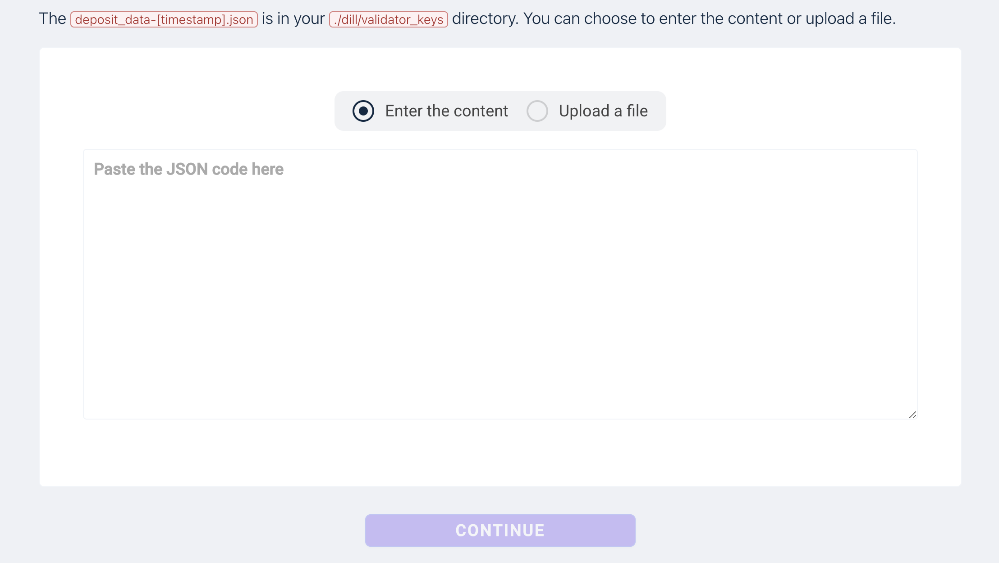
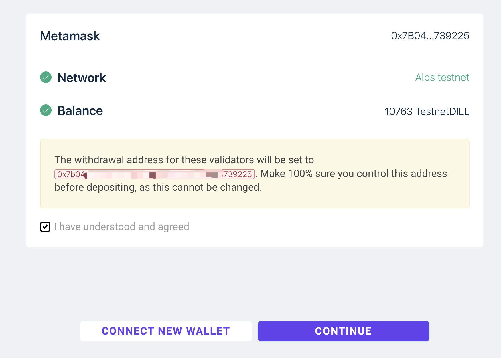
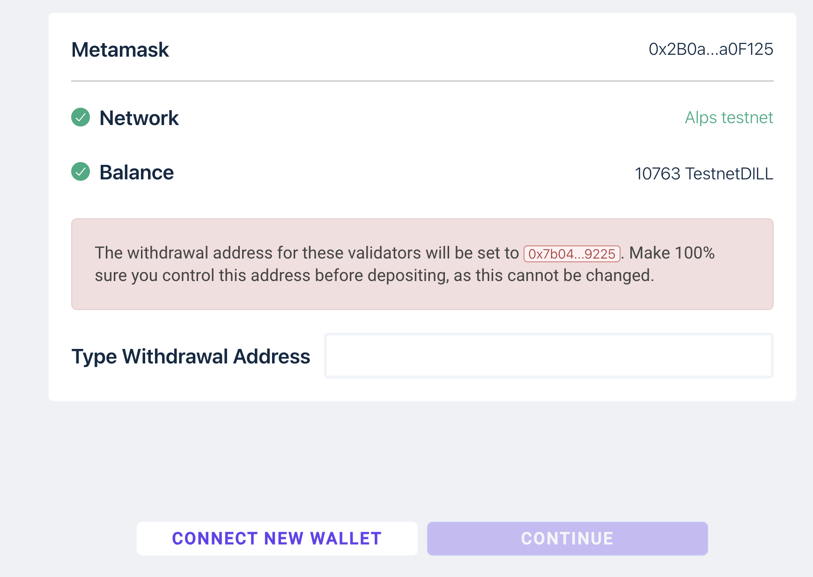
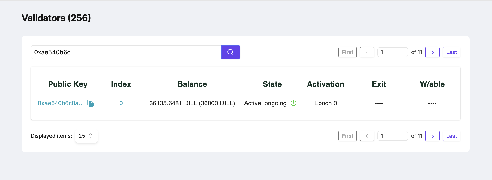

# Dill Public Testnet (Alps Testnet) Information


| Network Name  | Dill Testnet Alps  |
| ------------- | ------------------ |
| Rpc URL       | https://rpc-alps.dill.xyz/ |
| Chain ID      | 102125             |
| Currency Symbol | DILL             |
| Explorer URL  | https://alps.dill.xyz/ |

# Hardware Requirements

| Node Type     | CPU    | Memory | Disk  | Bandwidth | OS Type |
| ------------- | ------ | ------ | ----- | --------- | ------- |
| Light Validator | 2 Cores | 2GB  | 20GB  | 8Mb/s     | Ubuntu LTS 20.04+ / MacOS |
| Full Validator  | 4 Cores | 8GB  | 256GB | 64Mb/s    | Ubuntu LTS 20.04+ / MacOS |

# Get the test token
- Please join our [discord server](https://discord.gg/invite/dill) .
- Navigate to the #alps channel within the server.
- Request using $request (your address).
  
**Note**: This is for users with _alps-validator_ role.

# Instructions

## Setting up your dill node

To set up your Dill node for the Alps testnet, follow these steps.

### Step 1: Download and Run the Dill Node Script

Open your terminal and execute the following command to launch a new Dill node or add a validator to an existing node:

```bash
curl -sO https://raw.githubusercontent.com/DillLabs/launch-dill-node/main/dill.sh && chmod +x dill.sh && ./dill.sh
```

### Step 2: Select Your Node Type

After running the script, you will be prompted to choose between launching a new Dill node or adding a validator to an existing node.

```bash
Please choose an option for your purpose [1, Launch a new dill node, 2, Add a validator to existing node] [1]:
```

Choose `1` to launch a new node or `2` to add a validator.

### Step 3: Generating Validator Keys

Next, you will be prompted to generate your validator keys. You can either create a new mnemonic or use an existing one.

```bash
********** Step 3: Generating Validator Keys **********

Validator Keys are generated from a mnemonic
Please choose an option for mnemonic source [1, From a new mnemonic, 2, Use existing mnemonic] [1]:
```

- Choose `1` to generate a new mnemonic (ensure you save this securely).
- Choose `2` if you already have a mnemonic and wish to use it.

### Step 4: Setting Your Deposit Token Amount and Withdrawal Address

After generating your validator keys, you will be asked to select the deposit token amount for staking, and then to provide a withdrawal address.

1. **Choose a deposit token amount**:
   - Option `1`: 3600 DILL
   - Option `2`: 36000 DILL

```bash
Please choose an option for deposit token amount [1, 3600, 2, 36000] [1]: 1
```

2. **Enter your withdrawal address**:

You will be prompted to enter the Ethereum (Eth1) address where you would like your rewards to be sent.

```bash
Please enter your withdrawal address: 
```

3. **Warning**: Ensure the address is correct, and that you have control over it. If you use an Eth1 address, you will see this warning:

```bash
**[Warning] you are setting an Eth1 address as your withdrawal address. Please ensure that you have control over this address.**
```

4. **Repeat the withdrawal address** for confirmation:

```bash
Repeat your withdrawal address for confirmation:
```

After launching successfully, you should see an output like this:

```
Checking if the node is up and running...
node running, congratulations 😄
```

## How to Get and Upload Your deposit_data-xxxx.json File

- Navigate to the validator_keys Directory:
- Go to your folders, then to dill, and finally to validator_keys.
- Locate the deposit_data-xxxx.json file in this directory.
- Copy to target directory to save file (optional).
  

## Staking
You can use this webpage [Dill Staking](https://staking.dill.xyz/) to stake your tokens and become a validator:
  
### Upload your deposit info
You can paste the contents of your `deposit_data-xxxx.json` file into the input box, then click the "Continue" button to proceed with staking.

  
### Connect your wallet
If the wallet address you are using is the same as your withdrawal address, you only need to click the checkbox to confirm.


Otherwise, you need to fully enter your withdrawal address once.

  
### Send the deposit transaction


### Validator info

The validator information can be found here:  [Dill Explorer](https://alps.dill.xyz/validators)
After completing the staking process, you can search for your validator information on the page using your validator public key. It may take 0.5~1 hour to appear.



